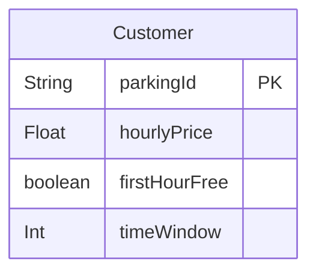

# Data Model Documentation

This document describes the data model for the LTI (Learning Tracking Initiative) application, including entity descriptions, field definitions, relationships, and an entity-relationship diagram.

## Model Descriptions

### 1. Customer
Represents a customer and their parking pricing configuration

**Fields:**
- `parkingId:`: Unique identifier for the customer (Primary Key)
- `hourlyPrice`: Hourly price
- `firstHourFree`: Determines if the first hour of parking is free.
- `timeWindow` Sets the maximum number of hours before full charge applies.

**Validation Rules:**
- parkingId must be unique and must be string
- hourly Price must be unique and must be double
- firstHourFree default is false
- timeWindow only allow 12 or 24 

## Entity Relationship Diagram

## Key Design Principles

1. **Referential Integrity**: All foreign key relationships ensure data consistency across the system.

2. **Flexibility**: The interview flow system allows for customizable hiring processes per position.

3. **Audit Trail**: Application and interview dates provide a complete timeline of the hiring process.

4. **Extensibility**: The modular design allows for easy addition of new features and data points.

5. **Data Normalization**: The model follows database normalization principles to minimize redundancy and ensure data integrity.

## Notes

- All `id` fields serve as primary keys with auto-increment functionality
- Foreign key relationships maintain referential integrity
- Optional fields allow for flexible data entry while maintaining required core information
- The interview system supports multi-step hiring processes with different types of interviews
- Email fields have unique constraints to prevent duplicate accounts 